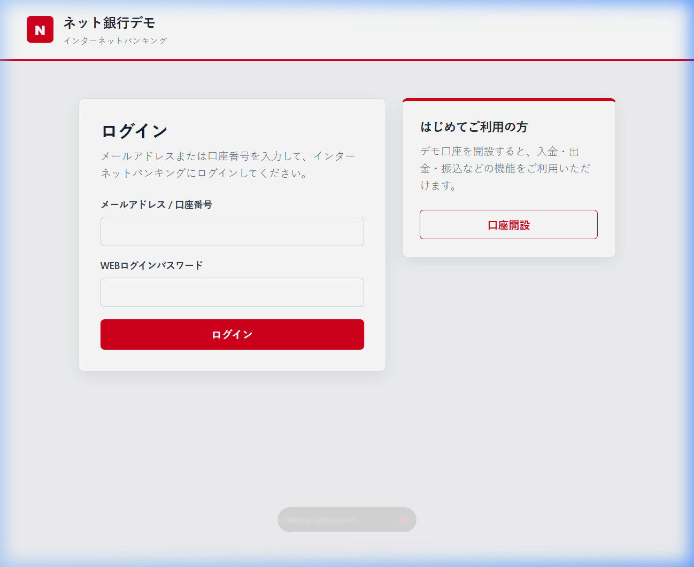
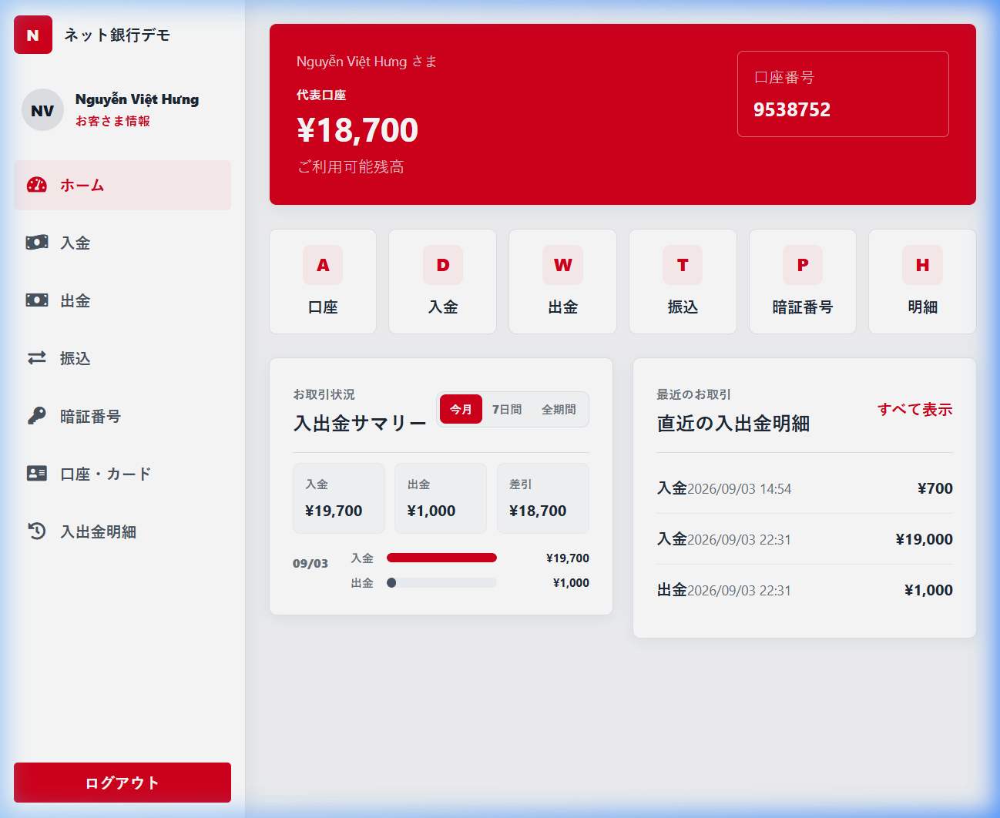
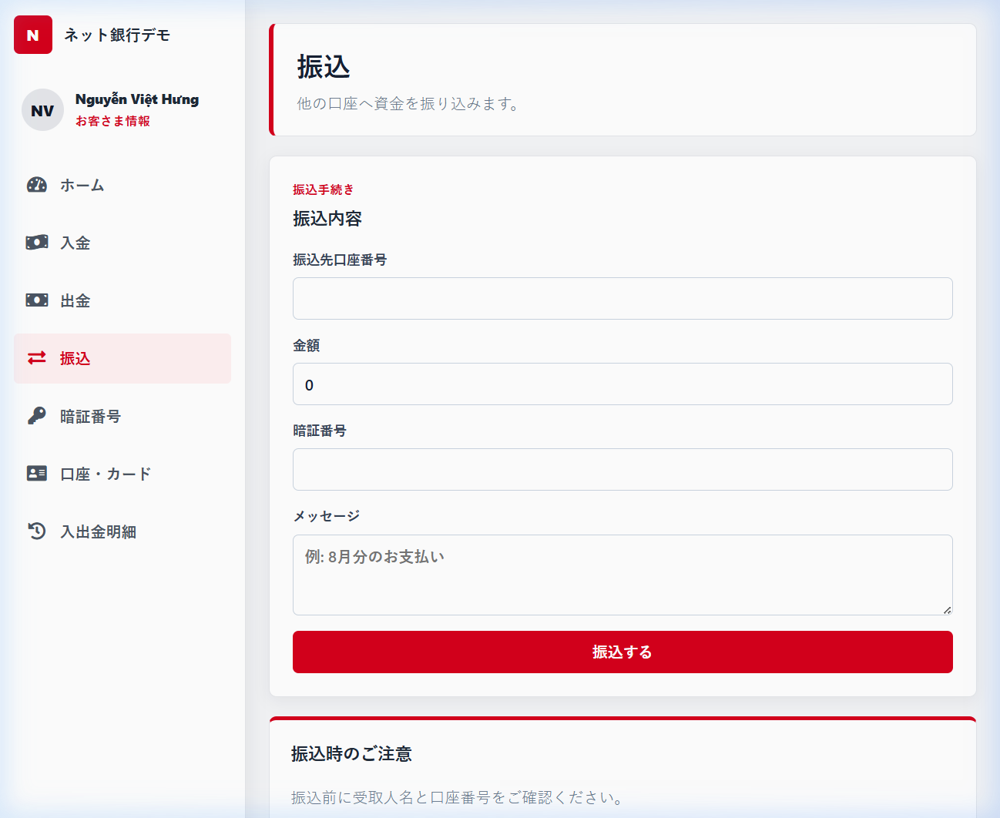
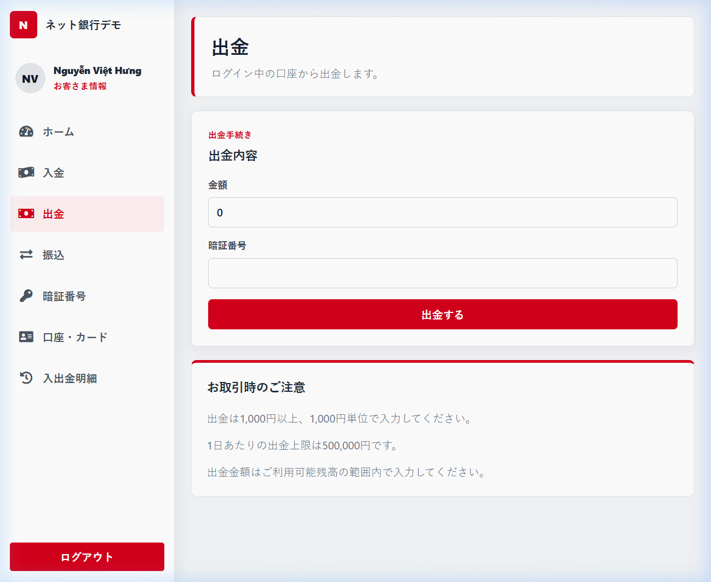
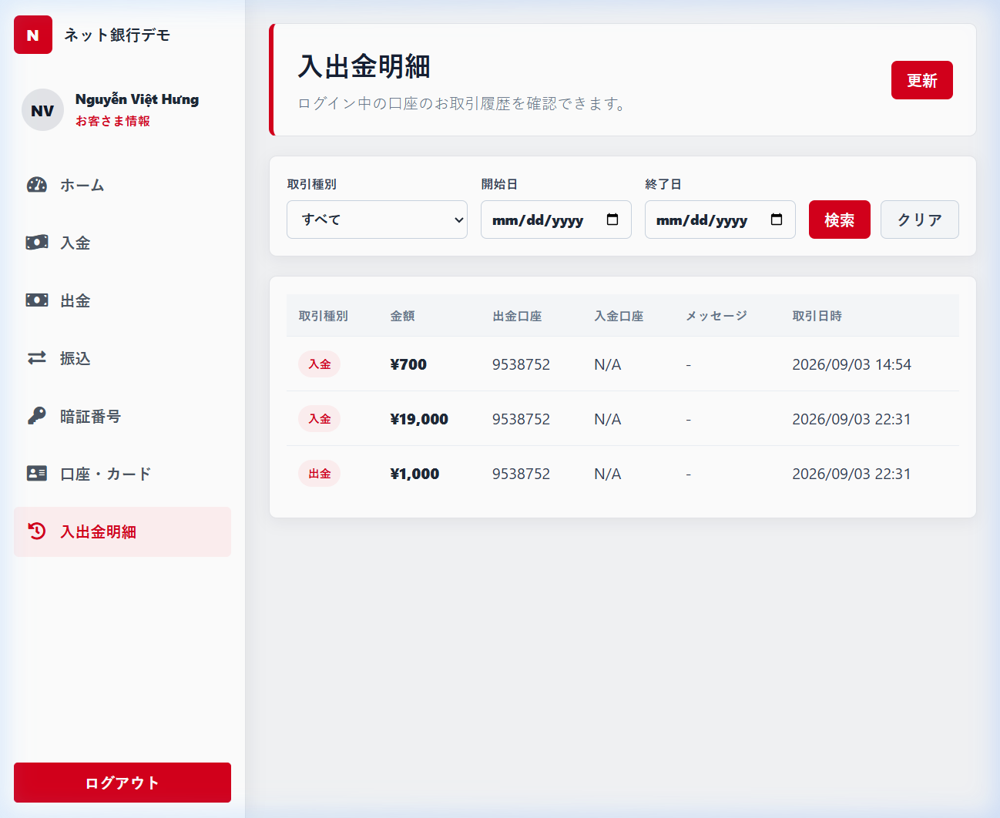

# 🏦 Banking Management System (ネット銀行デモ)

<p align="center">
  <b>A full-stack, enterprise-grade online banking application inspired by Japanese Net Banking design aesthetics.</b>
</p>

<p align="center">
  
  
  
  
  
  
</p>

---

## 📌 Overview

**Banking Management System** is a modern, secure, full-stack web application built to simulate core Internet Banking services. Designed with a clean Japanese banking UI, it allows users to manage financial accounts, perform instant money transfers, deposit and withdraw funds, set secure transaction PINs, and track real-time cash flow analytics.

---

## ✨ Key Features & Feature Showcase

### 1. 🔑 Secure Authentication & User Onboarding
* **JWT Authentication**: Stateless, token-based authentication with auto-refresh interceptors.
* **Dual Login Options**: Log in using registered email address or assigned account number.
* **Registration & Profile**: Account creation with automatic account number generation.

<p align="center">
  
</p>

---

### 2. 📊 Interactive Dashboard & Financial Overview
* **Account Balance Card**: Instant overview of available funds and unique account ID.
* **Cash Flow Analytics**: Monthly deposit, withdrawal, and net balance summary charts.
* **Quick Actions**: One-click navigation to Deposit, Withdraw, Transfer, PIN settings, and Statements.
* **Recent Activity Feed**: Real-time listing of recent incoming and outgoing transactions.

<p align="center">
  
</p>

---

### 3. 💸 Fund Transfer (振込)
* **Instant Transfers**: Send funds directly to another bank account number.
* **PIN Verification**: Enhanced security layer requiring transaction PIN before execution.
* **Transfer Memos**: Option to append notes/memos for recipient transaction tracking.

<p align="center">
  
</p>

---

### 4. 💵 Deposit & Withdrawal (入金・出金)
* **Deposit Funds**: Instantly top-up account balance with PIN verification.
* **Withdraw Funds**: Safely withdraw cash with real-time balance check and PIN validation.
* **Transaction Limits**: Daily transaction limit validations and minimum amount rules.

<div align="center">
  <table border="0">
    <tr>
      <td align="center">
        <b>Deposit Funds</b><br/>
        
      </td>
      <td align="center">
        <b>Withdraw Funds</b><br/>
        
      </td>
    </tr>
  </table>
</div>

---

### 5. 📜 Transaction History & Audit Log (入出金明細)
* **Comprehensive Logs**: View full transaction history (Deposit, Withdrawal, Transfer).
* **Date & Type Filtering**: Filter transactions by type (All, Deposit, Withdraw, Transfer) and custom date ranges.
* **Detailed Receipts**: Displays sender/receiver account numbers, timestamp, and memo notes.

<p align="center">
  
</p>

---

## 🛠️ Tech Stack & Architecture

### Backend
* **Language & Framework**: Java 17, Spring Boot 3.3
* **Security**: Spring Security, JWT (JSON Web Tokens), BCrypt Password Hashing
* **Data Access**: Spring Data JPA, Hibernate, MySQL 8.0
* **Architecture**: Layered Architecture (Controller -> Service -> Repository -> Entity)

### Frontend
* **Framework**: Angular 18 (Standalone Components, RxJS, Signals)
* **Styling**: Modern CSS, Responsive Layout, Glassmorphism & Custom Design System
* **HTTP & Security**: Angular Functional Guards, HTTP Interceptors for JWT Injection

### Infrastructure & DevOps
* **Containerization**: Docker, Docker Compose
* **Web Server**: Nginx (Reverse Proxy for Frontend static hosting & API routing)

---

## 🚀 Quick Start with Docker

### Prerequisites
* [Docker Desktop](https://www.docker.com/products/docker-desktop/) installed and running.

### 1. Clone & Run

```bash
# Clone the repository
git clone https://github.com/VietHung0/Banking-Management-System.git
cd Banking-Management-System

# Start all services with Docker Compose
docker compose up --build -d
```

### 2. Access Services

| Service | Endpoint URL | Port |
| :--- | :--- | :--- |
| **Frontend Web App** | `http://localhost:4200` | `4200` |
| **Backend REST API** | `http://localhost:8180` | `8180` |
| **MySQL Database** | `localhost:3307` | `3307` |

### 3. Stop Application

```bash
docker compose down
```

---

## 📄 License & Author

Developed by **Nguyễn Việt Hưng** as a full-stack banking management showcase project.


